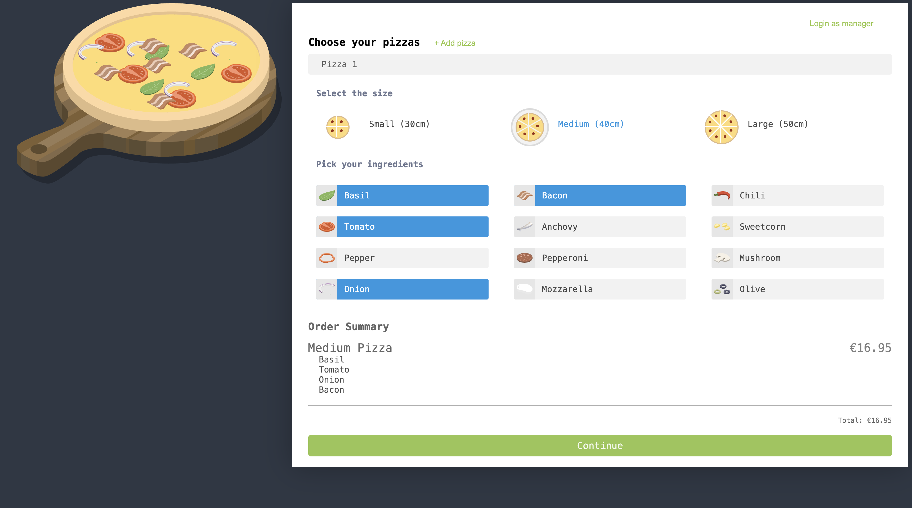
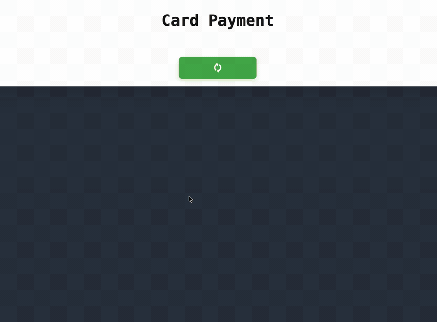

# Pizza Builder

Build a pizza, order it, then watch the courier drive to your door on a live map.

**[▶ Live demo](https://oplichta.github.io/pizza-builder/)**




---

## Try it in 60 seconds

1. **Build a pizza.** Pick a size, click toppings — they drop onto the pizza and the price updates live. Add a second pizza with **+ Add pizza**.
2. **Continue to the order form**, then try a promo code: `PIZZA20`, `MARGHERITA` or `STUDENT`. There is no _Apply_ button — it validates as you type.
3. **Pay** (simulated) and the delivery map draws a real driving route to the address you entered, with the courier moving along it.
4. **Manager panel** at `/manager` — sign in with `manager` / `Testmanager1@` and toggle which toppings customers can see. Changes hit Firestore and show up in the builder immediately.

> The manager login is a deliberately fake, client-side check for demo purposes. Real authentication is what the NestJS backend below is for.

---

## Features

- **Multi-pizza builder** — size, toppings and per-pizza pricing, all held in NgRx.
- **Live promo-code validation** — debounced, no submit button, with loading/valid/invalid states.
- **Delivery simulation** — real Mapbox geocoding and Directions API, with the courier animated along the returned route via `requestAnimationFrame`.
- **Manager panel** — real-time Firestore reads and writes to control topping visibility.
- **Custom form control** — the size picker is a `ControlValueAccessor`, so it plugs into `formControlName` like a native input.
- **Responsive** down to mobile widths.



---

## Architecture decisions

### Three state mechanisms, one rule for choosing

This app deliberately runs NgRx, RxJS and Signals side by side. They aren't competing — each owns a different kind of state:

| Mechanism      | What it holds here                                                                                                  | Where                                                                                                                             |
| -------------- | ------------------------------------------------------------------------------------------------------------------- | --------------------------------------------------------------------------------------------------------------------------------- |
| **NgRx Store** | State shared across components: pizzas in the order, toppings from Firestore, active pizza, totals                  | [`src/app/store/`](src/app/store/)                                                                                                |
| **RxJS**       | Anything that is a stream over time: Firestore reads, Mapbox HTTP calls, form `valueChanges`, the simulated payment | Effects and `store.select()`                                                                                                      |
| **Signals**    | Local synchronous UI state: order-form values, form validity, delivery details passed between routes                | [`order.component.ts`](src/app/order/order.component.ts), [`order-details.service.ts`](src/app/services/order-details.service.ts) |

The rule the codebase follows:

```
async event / network / time  →  RxJS
global state, many consumers  →  NgRx
a plain "right now" value     →  Signal
```

### Why the promo code bridges Signals and RxJS

[`promo-code.component.ts`](src/app/components/promo-code/promo-code.component.ts) is the one place where both worlds meet, because the feature genuinely needs both.

Reading store state is a pull: `toSignal(store.select(selectPromo))` gives a value the template can read directly, with no `async` pipe and no subscription to manage. Reacting to typing is a push: the input signal goes back through `toObservable()` so it can be debounced and de-duplicated before anything is dispatched.

Two details worth pointing out:

- **Normalisation happens before de-duplication.** `map(code => code.trim().toUpperCase())` runs _before_ `distinctUntilChanged()`, otherwise `"pizza20"` and `"PIZZA20 "` would count as different codes and fire two identical requests.
- **`skip(1)` is not cosmetic.** `toObservable()` is built on `effect()`, so it emits the signal's current value on subscribe. Without skipping it, simply opening `/order` would dispatch `clearPromoCode` before the user typed anything.

### Why `/delivery` is lazy-loaded

`mapbox-gl` is 1.85 MB — larger than the rest of the app combined. It is the only lazy route in [`app.routes.ts`](src/app/app.routes.ts), which keeps it out of the initial bundle for the majority of visitors who never reach the delivery screen.

It also needs a workaround: Angular's esbuild builder can't bundle Mapbox's blob-based worker, so [`delivery.component.ts`](src/app/delivery/delivery.component.ts) points `mapboxgl.workerUrl` at the pre-built CSP worker copied into `public/`.

### Why the size picker is a `ControlValueAccessor`

[`pizza-size.component.ts`](src/app/components/pizza-size/pizza-size.component.ts) implements `ControlValueAccessor` rather than exposing inputs and outputs. That buys native Reactive Forms integration — `formControlName="pizzaSize"`, validation and form state work exactly as they would on an `<input>`, with no special handling in the parent.

---

## Tech stack

**Angular 21** (standalone components, `@if` / `@for` control flow, signals) · **NgRx 21** (store, effects, devtools) · **RxJS 7** · **Firebase / Firestore** · **Mapbox GL JS** · **Jest 30** with `jest-preset-angular` · **SCSS** · **TypeScript** in `strict` mode with `strictTemplates`

---

## Configuration

`enviroment.ts` is committed on purpose. It contains **public client identifiers, not secrets**.

A Firebase web API key identifies a project — it isn't a credential. It ships inside every client bundle by design, so keeping it out of the repository would protect nothing while breaking the clone-and-run experience. In a Firebase app, access control belongs in Firestore Security Rules, not in hiding the config.

Here, Firestore is a zero-setup data source for the demo, and it's being replaced by the NestJS API described below — which is where authentication and server-side authorisation will live. Genuine secrets never go in this file; those belong in `.env`, which is gitignored.

The Mapbox token is handled differently, and deliberately so. `enviroment.ts` ships a placeholder; the real `pk.` token lives in `enviroment.local.ts`, which is gitignored and swapped in by the `deploy` build configuration via Angular's `fileReplacements`. A client-side map token is public the moment it reaches a browser — the URL restriction on it is what actually protects it — but keeping it out of the repository avoids the automated scanners that trawl public repos for credentials. Copy `enviroment.local.example.ts` to set it up; if the file is missing, the deploy build fails instead of silently publishing a dead map.

---

## Getting started

Requires Node 20+.

```bash
npm install
npm start          # http://localhost:4200
```

That's it — the committed Firebase config backs the toppings list, so the builder, ordering and manager panel all work immediately.

**For the delivery map** you need your own free Mapbox token: grab one at [account.mapbox.com](https://account.mapbox.com/access-tokens/) and drop it into `mapboxAccessToken` in `enviroment.ts`. Every other screen works without it. (For deployments the token comes from `enviroment.local.ts` instead — see [Configuration](#configuration).)

**To use your own Firebase project**, copy `enviroment.example.ts` over `enviroment.ts`. Your Firestore needs an `ingredients` collection of `{ name: string, visible: boolean, pizzaId: number }` documents, where `name` matches an SVG in `public/images/` — `mozzarella`, `pepperoni`, `tomato`, `onion`, `basil`, `chili`, `mushroom`, `anchovy`, `sweetcorn`, `bacon`, `prawn`, `olive`, `pepper`. Without that collection the builder renders an empty topping list.

---

## Testing

```bash
npm test               # 30 tests across 16 suites
npm run test:coverage
```

Coverage focuses on component logic and store integration — dispatching the right actions, deriving the right view state, and the `ControlValueAccessor` contract. Reducers, selectors and `promo.effects` are not covered yet; they're pure functions and next on the list.

---

## Deployment

```bash
npm run deploy         # or: ng deploy
```

Deployment goes through [`angular-cli-ghpages`](https://github.com/angular-schule/angular-cli-ghpages), registered as the project's `deploy` builder. It runs the `production,deploy` build — which swaps in the real Mapbox token from the gitignored `enviroment.local.ts` — then pushes `dist/pizza-builder/browser` to the `gh-pages` branch, adding the `404.html` that GitHub Pages needs for client-side routing.

The build sets `baseHref: /pizza-builder/` in `angular.json`. If you fork this under a different repository name, change it there or every asset 404s.

---

## Roadmap and known limitations

**Replacing Firebase with a custom NestJS API** _(in progress)_ — Firestore was chosen as a zero-setup data source to get the front end moving. It's being replaced by a NestJS + PostgreSQL backend with real authentication, which moves the manager panel off a client-side session flag and puts data access behind an authorised API.

Smaller gaps, listed honestly:

- Payment is simulated — there is no real payment provider.
- The order form has no city field, so geocoding is constrained to Poland.
- No ESLint and no CI pipeline yet.
- Accessibility needs work: several interactive elements are `div`s without keyboard support.
